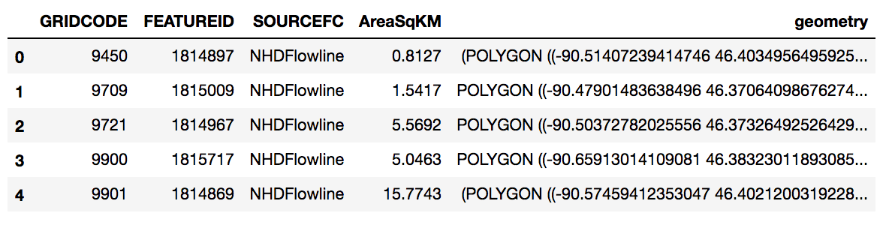

# GIS_utils
`GIS_utils` is a collection of convenience functions for working with the python GIS toolchain, including the **`fiona`**, **`shapely`**, **`rasterio`**, **`pyproj`**, and **`rtree`** packages. It contains two primary modules:   

* **`GISio`**, which reads and writes information to/from GIS file formats, and  

*	**`GISops`**, which can perform operations such as clipping, reprojection and intersections.


### To install:
Clone or download the repository, and then from a command prompt in the repository folder:
```
$ python setup.py install
```
### Install via pip
```
$ pip install https://github.com/aleaf/GIS_utils/archive/master.zip
```

### To import:
```python
import GISio
import GISops
```

## Examples
#### Read a shapefile or .dbf file into a `pandas DataFrame`:
* geometry information for each feature is stored in a geometry column as a **`shapely`** object.
* a collection of shapefiles can be read by supplying a list instead of a single file path.

```python
from GISio import shp2df
df = shpdf(data.shp)
df.head()
```

#### Write a dataframe to a shapefile:
Coordinate reference system (CRS) information can be supplied as an [epsg code](http://epsg.io/), [proj4 string](http://proj4.org/parameters.html), **`*.prj`** file, or [fiona CRS dictionary](https://toblerity.org/fiona/manual.html#format-drivers-crs-bounds-and-schema).  

```python
from GISio import df2shp 
df2shp(df, 'outfile.shp', epsg=26715)
```
#### Reproject (x,y) tuple(s) or `shapely` object(s) to another CRS
```python
from GISops import project
project((-90, 45), '+init=epsg:4269', '+init=epsg:26715')
```
result:

```python
array([ 736463.20877518, 4987116.50459679])
```
```python
from shapely.geometry import Polygon
project(geom, '+init=epsg:4269', '+init=epsg:26715')
```
result:
```
POLYGON ((736463.2087751778 4987116.504596788, 732312.4084356854 5098212.402173721, 809739.8330817271 5101618.329562293, 815279.1881284819 4990525.071498179, 736463.2087751778 4987116.504596788))
```

#### Intersections using `rtree`
Given lists of `shapely.geometry` objects (**`geom1`** and **`geom2`**), get the indices of the objects in **`geom1`** that intersect each object in **`geom2`**. Three steps are performed:

1) A spatial index (`rtree.index.Index()`) is created for the bounding boxes of items in **`geom1`**.  
2) Bounding boxes for the items in **`geom2`** are intersected with the spatial index.  
3) Intersections from step 2 are tested using the actual **`shapely`** geometries using the `.intersects()` method.

```python
from GISops import intersect_rtree
intersect_rtree(geom1, geom2)
```
result: 
```[[ind1, ind2, ind3...], [ind1, ind2...]...]
```
